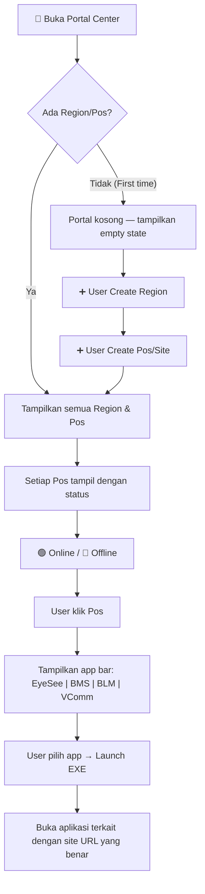
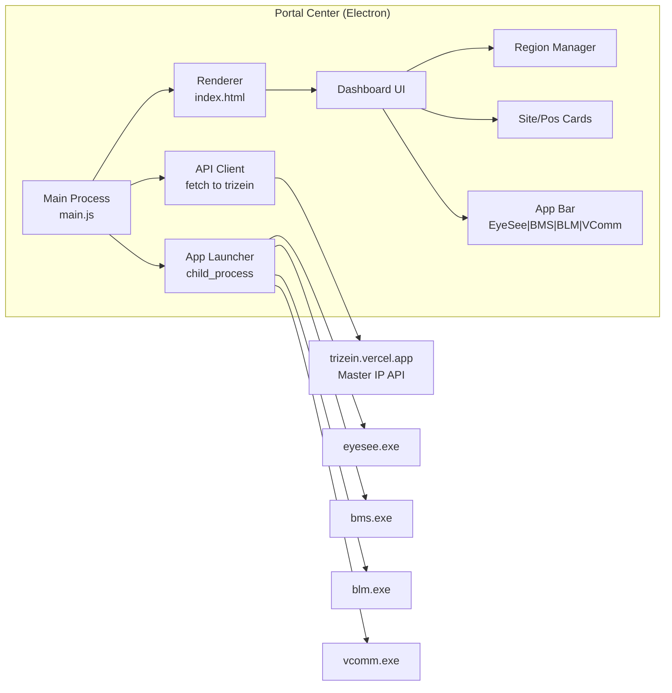

# 🎯 Portal Center — Discussion & Architecture

## 1. Pemahaman Saya Tentang Project

### Apa itu Portal Center?
Portal Center adalah **Electron desktop application** yang berfungsi sebagai **Command Center Hub** — sebuah dashboard pusat yang mengelola semua site/pos secara real-time. Ini berbeda dari aplikasi existing (EyeSee, BMS, BLM, VComm) yang masing-masing fokus ke satu fungsi.

### Perbedaan dengan Site Selector Existing
| Aspek | Site Selector (Existing) | Portal Center (Baru) |
|-------|-------------------------|---------------------|
| Fungsi | Pilih 1 site → buka 1 app | Manage **semua** site sekaligus |
| Flow | Select → Load webview | Dashboard → Manage regions & pos → Launch apps |
| Data | Read-only dari API | **CRUD** — bisa create/update/delete region & pos |
| Scope | Per-app (EyeSee punya sendiri, BMS sendiri) | **Unified** — semua app dalam 1 portal |
| Target user | Operator di lapangan | **Command Center** operator |

### Flow yang Saya Pahami



---

## 2. Data dari API yang Tersedia

### Base URL: `https://trizein.vercel.app`

### Apps Available (dari `/api/v1/apps`)
| Key | Name | Type | Total Sites |
|-----|------|------|-------------|
| `router` | Gateway | SERVER | 22 |
| `proxmox` | Proxmox Server | SERVER | 22 |
| `maps` | Maps | APP | 22 |
| `bms` | Battle Management System | APP | 22 |
| `blm` | Battle Logistic Management | APP | 22 |
| `eyesee` | EYESEE | APP | 22 |
| `storage` | Storage Server | SERVER | 22 |
| `chat` | Chat (VComm) | APP | 22 |

### Regions (dari `/api/v1/regions`)
- Saat ini: **1 region** — `PAPUA` dengan 1 site terdaftar (SITE-01)
- API mendukung CRUD regions

### Sites (dari `/api/v1/sites`)
- **22 sites** tersedia (SITE-01 s/d SITE-22)
- Setiap site punya 8 IP entries (3 SERVER + 5 APP)
- IP pattern: block `/27` per site

### API Endpoints yang Dibutuhkan Portal

| Kebutuhan | Endpoint | Method |
|-----------|----------|--------|
| List semua regions | `GET /api/v1/regions` | Public |
| Detail region + sites | `GET /api/v1/regions/:code/sites` | Public |
| Create region | `POST /api/v1/regions` | Auth ✅ |
| Update region | `PUT /api/v1/regions/:code` | Auth ✅ |
| Delete region | `DELETE /api/v1/regions/:code` | Auth ✅ |
| List semua sites | `GET /api/v1/sites` | Public |
| Create site | `POST /api/v1/sites` | Auth ✅ |
| Update site | `PUT /api/v1/sites/:code` | Auth ✅ |
| Delete site | `DELETE /api/v1/sites/:code` | Auth ✅ |
| Get app IP for site | `GET /api/v1/apps/:appKey/:siteCode` | Public |
| Quick lookup | `GET /api/v1/lookup?app=X&site=Y` | Public |
| Summary/stats | `GET /api/v1/summary` | Public |

---

## 3. Architecture Design

### 3.1 Standalone Electron App (di `portal-center/`)

```
portal-center/
├── main.js                 # Electron main process
├── preload.js              # Context bridge (IPC)
├── package.json
├── server-config.json      # API config
├── index.html              # Main portal dashboard  
├── assets/
│   ├── css/
│   │   └── portal.css      # Styling
│   ├── icons/
│   │   └── png/            # App icons
│   └── js/
│       ├── portal-app.js   # Main portal logic
│       ├── api-client.js   # API wrapper
│       └── app-launcher.js # Launch exe files
├── src/
│   └── ...                 # Shared modules if needed
└── build.js                # Build script
```

### 3.2 Komponen Utama



---

## 4. UI/UX Concept

### Layout
```
┌──────────────────────────────────────────────────────────────┐
│  🛡️ COMMAND CENTER PORTAL          [Settings] [🔔] [User]   │
├──────────────────────────────────────────────────────────────┤
│                                                              │
│  📊 Summary Bar                                              │
│  ┌──────┐ ┌──────┐ ┌──────┐ ┌──────┐                       │
│  │ 22   │ │ 15   │ │ 7    │ │ 1    │                       │
│  │Total │ │Online│ │Offln │ │Region│                       │
│  └──────┘ └──────┘ └──────┘ └──────┘                       │
│                                                              │
│  ─── App Quick Filter ──────────────────────────────────     │
│  [EyeSee] [BMS] [BLM] [VComm] [All]    ← Middle bar        │
│  ─────────────────────────────────────────────────────────   │
│                                                              │
│  📍 REGION: PAPUA                          [+ Add Region]    │
│  ┌─────────────────┐ ┌─────────────────┐ ┌──────────────┐  │
│  │ 🟢 Site 1       │ │ 🔴 Site 2       │ │ 🟢 Site 3    │  │
│  │ (Pos Bayangan)  │ │ (Pos Gunung)    │ │ (Pos Laut)   │  │
│  │ 172.27.0.0/27   │ │ 172.27.0.32/27  │ │ 172.27.0.64  │  │
│  │                 │ │                 │ │              │  │
│  │ [ES][BMS][BLM]  │ │ [ES][BMS][BLM]  │ │ [ES][BMS]    │  │
│  │ [VC]            │ │ [VC]            │ │ [BLM][VC]    │  │
│  └─────────────────┘ └─────────────────┘ └──────────────┘  │
│                                                              │
│  [+ Add Pos/Site]                                            │
│                                                              │
└──────────────────────────────────────────────────────────────┘
```

### Key UI Features
1. **Empty State** — Ketika pertama kali buka, tampilkan panduan untuk create region & pos
2. **Region Groups** — Sites dikelompokkan per region, bisa expand/collapse
3. **Site Cards** — Setiap site menampilkan:
   - Nama site + alias (misal "Pos Bayangan")
   - Status online/offline (real-time check)
   - IP block
   - App quick-launch buttons (EyeSee, BMS, BLM, VComm)
4. **App Filter Bar** — Bar di tengah untuk filter view berdasarkan app type
5. **CRUD Modals** — Dialog untuk create/edit/delete region & site

---

## 5. Pertanyaan & Keputusan yang Perlu Didiskusikan

### ❓ Q1: Bagaimana "Launch EXE" bekerja?
Ada beberapa opsi:
- **Opsi A**: Portal Center spawn `child_process.exec()` untuk menjalankan `.exe` yang sudah ada di folder masing-masing (eyesee-exe, bms-exe, dll) dengan parameter site
- **Opsi B**: Portal Center langsung embed webview ke dalam portal itu sendiri (multi-tab)
- **Opsi C**: Portal Center buka instance baru Electron window yang load webview URL

> **Rekomendasi saya**: **Opsi A** — Launch exe terpisah. Karena setiap app (EyeSee, BMS, BLM, VComm) sudah punya exe masing-masing yang sudah mature dengan DNS resolver, license system, dll. Portal Center cukup trigger launch dan pass site info.

### ❓ Q2: Auth untuk CRUD operations?
API butuh auth (`X-API-Key` header atau session cookie). Portal perlu:
- Login form ke API?
- Atau hardcode API key di config?

### ❓ Q3: Portal Center ini Electron app mandiri atau bagian dari monorepo existing?
- Saya lihat folder `portal-center/` sudah ada (kosong) di dalam `eyesee-exe/`
- Apakah ini akan jadi **sub-project mandiri** dengan `package.json` sendiri?
- Atau **share** modules dari parent project?

### ❓ Q4: Hubungan antara "create site di portal" dan "site muncul di exe apps"?
- Ketika user create Pos baru di portal → API create site baru di master-site
- Exe apps (EyeSee, dll) juga membaca dari API yang sama
- Jadi secara otomatis site baru akan muncul di semua apps?

### ❓ Q5: Tentang gambar yang Anda sebutkan
Anda menyebutkan "seperti di gambar" — saya belum melihat gambar yang di-attach. Bisa kirimkan gambar/screenshot desain portal yang Anda maksud? Ini akan sangat membantu saya memahami exact layout yang diinginkan.

---

## 6. Proposed Implementation Plan

### Phase 1: Foundation (Core Setup)
- [ ] Setup Electron project di `portal-center/`
- [ ] Create `main.js`, `preload.js`, `package.json`
- [ ] Setup `server-config.json` dengan API URL trizein.vercel.app
- [ ] Basic window dengan titlebar

### Phase 2: Dashboard UI
- [ ] Build portal dashboard HTML/CSS
- [ ] Summary stats bar
- [ ] Empty state UI
- [ ] Region section with expand/collapse

### Phase 3: API Integration
- [ ] API client untuk CRUD regions & sites
- [ ] Fetch & display regions + sites
- [ ] Online/offline status check per site
- [ ] Real-time status polling

### Phase 4: CRUD Operations
- [ ] Create Region modal
- [ ] Create Site/Pos modal  
- [ ] Edit Region/Site
- [ ] Delete with confirmation

### Phase 5: App Launcher
- [ ] App bar (EyeSee, BMS, BLM, VComm)
- [ ] Launch mechanism (child_process / config)
- [ ] Pass site info ke launched app

### Phase 6: Polish
- [ ] Animations & transitions
- [ ] Error handling & retry
- [ ] Build script
- [ ] Testing

---

> [!IMPORTANT]
> Sebelum saya mulai implementasi, saya perlu feedback dari Anda untuk pertanyaan Q1-Q5 di atas. Terutama tentang mekanisme launch EXE dan desain UI yang diinginkan.
